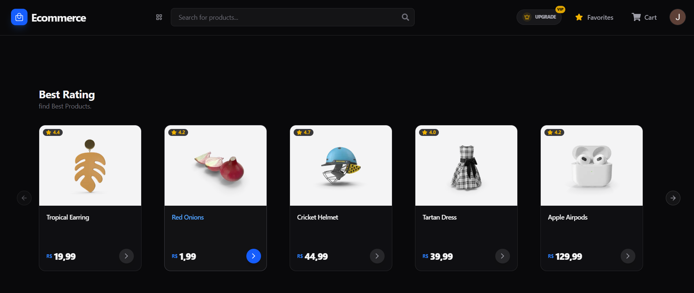
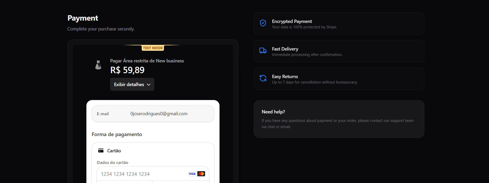

# 🛍️ E-commerce Full Stack - Next.js 16 & Stripe Custom Checkout

Este projeto é um ecossistema completo de e-commerce construído do zero com as tecnologias mais recentes do mercado (Next.js 16 e React 19). O foco principal foi desenvolver uma experiência de usuário fluida e segura, com um checkout totalmente integrado à plataforma, gestão avançada de estado e arquitetura escalável.

## 📸 Prévia da Aplicação
> **Dica:** Adicione aqui um GIF ou imagem da sua tela de produtos e do seu checkout customizado.
<p align="center">
  
</p>
<p align="center">
  
</p>

## 🌟 Funcionalidades do Sistema

### 🛒 Loja, Carrinho e Favoritos
1. **Gestão de Estado Global:** Carrinho de compras reativo e persistente gerenciado com Zustand.
2. **Catálogo Dinâmico:** Páginas de produtos detalhadas, sistema de favoritos e listagem de itens no carrinho.
3. **Painel de Compras:** Área do cliente com histórico completo de produtos comprados e faturas emitidas.

### 💳 Pagamentos e Assinaturas (Stripe Integrado)
1. **Checkout Customizado (Stripe Wrapper):** Diferente de checkouts tradicionais que redirecionam o usuário, o pagamento é processado dentro da própria aplicação utilizando Stripe Elements, garantindo maior conversão e retenção visual.
2. **Gestão de Assinaturas:** Lógica completa de planos de assinatura, incluindo verificação de status e uso de limites.
3. **Wallet Segura:** Exibição segura de métodos de pagamento (apresentando apenas os 4 últimos dígitos do cartão) e histórico de faturas direto da Stripe.
4. **Sincronização via Webhooks (Hooks):** Implementação de uma rota de Webhook dedicada para escutar eventos da Stripe (customer.subscription.updated). Isso garante que o status do plano do usuário no banco de dados esteja sempre em sincronia com o pagamento real.

### 🛡️ Autenticação e Segurança (Auth.js)
1. **Sistema de Login Completo:** Autenticação moderna utilizando NextAuth v5 (Auth.js) com credenciais e integração segura.
2. **Autenticação em Duas Etapas (2FA):** Camada extra de segurança para os usuários da plataforma.
3. **Recuperação de Senha Segura:** Fluxo de "Esqueci minha senha" utilizando tokens JWT e envio de e-mails transacionais com a Resend.
4. **Proxy de Dados:** Camada de abstração que protege o acesso a rotas.

### ⚡ Arquitetura e Performance
1. **Data Access Layer (DAL):** Separação rigorosa das chamadas de banco de dados, garantindo que componentes de UI não acessem diretamente o Prisma.
2. **Estratégias de Cache (Next.js):** Gerenciamento inteligente de cache e revalidação de rotas seguindo as severas diretrizes do App Router do Next.js 16.
3. **Banco de Dados Dockerizado:** Ambiente de desenvolvimento padronizado com PostgreSQL via Docker e seed inicial automatizado.

## 🛠️ Stack Tecnológico

### Core & UI
- **[Next.js 16.1](https://nextjs.org/)**: Framework React com App Router, Server Actions e renderização dinâmica/estática.
- **[React 19](https://react.dev/)**: Biblioteca base atualizada com as mais recentes otimizações.
- **[Tailwind CSS v4](https://tailwindcss.com/)**: Estilização utilitária de alta performance.
- **[Shadcn/UI](https://ui.shadcn.com/)**: Componentes de interface modernos e customizáveis.
- **[Zustand](https://zustand-demo.pmnd.rs/)**: Gerenciamento de estado global leve e rápido para o carrinho e UI.

### Back-End & Persistência
- **[Prisma ORM](https://www.prisma.io/orm)**: Modelagem e tipagem estática do banco de dados relacional PostgreSQL.
- **[PostgreSQL](https://www.postgresql.org/)**: Banco de dados principal rodando em containers Docker.

### Pagamentos & Serviços
- **[Stripe SDK & React Stripe JS](https://docs.stripe.com/stripe-js)**: Processamento de pagamentos, assinaturas e webhooks com componentes UI hospedados localmente.
- **[Auth.js (NextAuth v5)](https://authjs.dev/)**: Autenticação flexível e segura compatível com Edge e Server Components.
- **[Resend](https://resend.com/) & [React Email](https://react.email/)**: Criação e envio de e-mails transacionais (2FA, Reset de Senha) codificados em React.
- **[Zod](https://zod.dev/)**: Validação rigorosa de formulários e schemas de dados.

## 🚀 Guia de Instalação e Setup

1. **Pré-requisitos**
- Node.js (v20+ recomendado)
- Docker & Docker Compose
- Contas ativas na Stripe e Resend para as chaves de API.

2. **Configuração Inicial**
Clone o repositório e instale as dependências:
```bash
git clone [https://github.com/JRodriguesDev/ecommerce-next16.git](https://github.com/JRodriguesDev/ecommerce-next16.git)
cd ecommerce-next16
npm install
